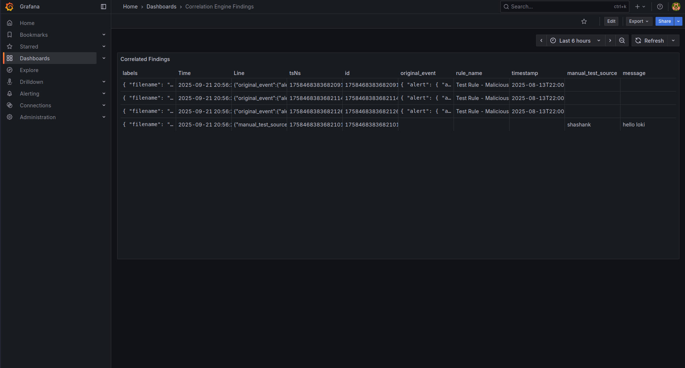
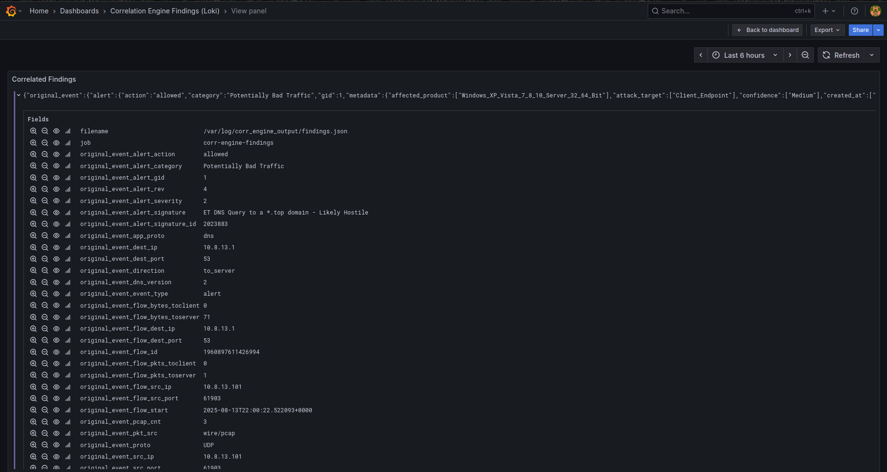

# NetMon: A Dockerized Network Security Monitor with a Custom C++ Correlation Engine

## Overview

NetMon is a containerized Network Security Monitoring (NSM) suite designed for real-time analysis of network traffic. It uses the Suricata IDS engine to generate alerts from PCAP files, which are then processed by a stateful C++ correlation engine. This allows for flexible and real-time analysis of security events, with the results visualized on a Grafana dashboard.

## Dashboard Preview
<details>
  <summary>Click to view dashboard screenshots</summary>
  <p align="center">
    <em>Main Dashboard Overview</em><br>
    
    <br><br>
    <em>Example Alert Drill-Down</em><br>
    
  </p>
</details>
## Key Features

- **High-Performance Intrusion Detection**: Utilizes Suricata to analyze network traffic and generate detailed JSON event logs.
- **Advanced C++ Alert Correlation**: A lightweight, high-performance correlation engine processes Suricata's output in near real-time.
- **Stateful, Time-Based Analysis**: The engine can track the state of events over time, enabling the detection of complex, multi-stage attack patterns.
- **Flexible Rule Engine**: Correlation rules are defined in a simple YAML file, supporting both simple, stateless checks and complex, stateful sequences.
- **Centralized Logging & Visualization**: Findings are shipped via Promtail to Loki and visualized on an easily configured Grafana dashboard.
- **Containerized & Portable**: The entire suite is orchestrated with Docker Compose for easy setup and deployment on local machines.

## Architecture

The data flows through the NetMon components in a simple, logical pipeline:

```
+-----------------+      +--------------------+      +-----------------+      +------------+      +---------+
|  PCAP File(s)   |----->|      Suricata      |----->|  Correlation    |----->|  Promtail  |----->|   Loki  |
| (Network Data)  |      | (Generates Alerts) |      |  Engine (C++)   |      | (Ships Logs)  |      | (Stores)|
+-----------------+      +--------------------+      +-----------------+      +------------+      +---------+
                                                                                                     ^
                                                                                                     |
                                                                                               +-----------+
                                                                                               |  Grafana  |
                                                                                               | (Queries &|
                                                                                               | Visualizes)|
                                                                                               +-----------+
```

1.  **Suricata**: Reads `.pcap` files from the `app/pcaps` directory and generates alerts in `eve.json` format.
2.  **Correlation Engine**: The C++ engine (`corr-engine`) monitors `eve.json`, applies rules from `rules.yaml`, and writes matches to `findings.json`.
3.  **Promtail/Loki**: Promtail tails `findings.json` and sends the findings to Loki for storage and indexing.
4.  **Grafana**: Uses Loki as a data source to populate the "Correlation Engine Findings" dashboard.

## Getting Started

### Prerequisites

- Docker
- Docker Compose

### Installation and Running

1.  **Clone the repository:**
    ```bash
    git clone https://github.com/your-username/NetMon.git
    cd NetMon/app
    ```

2.  **Add Network Traffic (PCAP files):**
    Place any `.pcap` files you want to analyze into the `app/pcaps` directory. A sample PCAP known to generate alerts is included.

3.  **Build and Launch the Environment:**
    From the `app` directory, run the following command:
    ```bash
    docker-compose up -d --build
    ```

4.  **Access the Dashboard:**
    Open your web browser and navigate to `http://localhost:3000`.
    - **Username:** `admin`
    - **Password:** `NSMadmin`

    The "Correlation Engine Findings" dashboard will be available to view the correlated alerts.

## Customizing Rules

The core of the engine is the `rules.yaml` file (`app/corr-engine/rules/rules.yaml`). You can add rules to detect specific patterns.

**Example Rules:**
```yaml
rules:
  - name: "Test Rule - Malicious TOP Domain Query"
    condition: 'alert.signature == "ET DNS Query to a *.top domain - Likely Hostile"'

  - name: "High Severity Alert Detected"
    condition: "alert.severity == 1"
```

### Applying Changes

After modifying `rules.yaml`, you must restart the services from the `app` directory:
```bash
docker-compose up -d --force-recreate
```

## Troubleshooting

For common issues, such as Docker DNS errors or Grafana permission problems, please refer to the [troubleshooting guide](./docs/troubleshooting.md).
